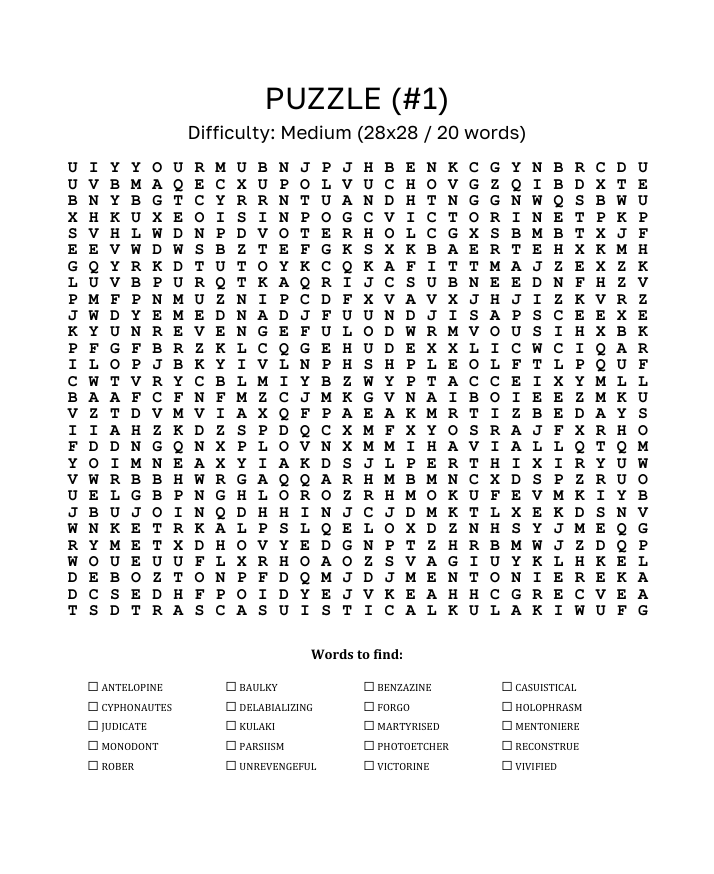

# 🧩 Custom Word Search Generator

A powerful, customizable Python tool that generates random Word Search puzzles. It takes a list of words, places them into a grid using a smart algorithm, and exports print-ready **Microsoft Word (.docx)** and **PDF** files.


It features adjustable difficulty levels, automated file numbering, and a fully customizable Word template system.

## ✨ Features
...

* **Smart Generation:** Places words horizontally, vertically, and diagonally (forward and backward).
* **Difficulty Scaling:** Automatically calculates how many words to hide based on the grid size and chosen difficulty (Easy, Medium, Hard, Impossible).
* **Dual Output:** Generates formatted `.docx` files and automatically converts them to `.pdf` for easy printing.
* **Template Support:** Uses a `template.docx` file, allowing you to change fonts, headers, logos, and page layout without touching the code.
* **Clean Layout:** Generates a gapless, monospaced letter grid and a neat, checkbox-style word list.

## 🛠️ Installation

1.  **Clone the repository** (or download the files):
    ```bash
    git clone [https://github.com/YOUR-USERNAME/word-search-generator.git](https://github.com/YOUR-USERNAME/word-search-generator.git)
    cd word-search-generator
    ```

2.  **Install dependencies:**
    Install all required libraries with a single command using the provided requirements file:
    ```bash
    pip install -r requirements.txt
    ```

    *(Note: Microsoft Word must be installed on your computer for the automatic PDF conversion to work.)*

## 🚀 How to Use

1.  **Prepare your words:**
    Open `words.txt` and add your words (one per line).

2.  **Run the script:**
    ```bash
    python main.py
    ```

3.  **Get your puzzle:**
    The script will generate a new puzzle in the `puzzles/` folder (e.g., `puzzle-1.docx` and `puzzle-1.pdf`). It automatically increments the puzzle ID each time you run it.

## ⚙️ Configuration

You can adjust the settings at the top of `main.py` in the `CONFIG` section:

| Setting | Description |
| :--- | :--- |
| `DIFFICULTY_LEVEL` | Controls word count density: `Easy`, `Medium`, `Hard`, `Impossible`. |
| `GRID_SIZE` | Size of the grid (e.g., `28` means a 28x28 grid). |
| `INPUT_FILE` | The text file containing your source words. |
| `FONT_FAMILY` | Font used for the grid (recommended: Monospaced fonts like Courier New). |

## 🎨 Template Customization (Tags)

The generator uses a `template.docx` file. You can edit this file in Microsoft Word to change the design. The program looks for specific **Tags** and replaces them with the puzzle content.

### Available Tags:

| Tag | What it does |
| :--- | :--- |
| **`[GRID]`** | **Required.** This is where the letter grid will be inserted. |
| **`[WORDS]`** | **Required.** This is where the checkbox word list will be inserted. |
| **`[DIFFICULTY]`** | Displays the current difficulty setting (e.g., "Medium"). |
| **`[ID]`** | Displays the unique puzzle number (e.g., "1", "2"). |
| **`[INFO]`** | Displays technical stats (e.g., "(28x28 / 24 words)"). |

**How to edit the template:**
1. Open `template.docx`.
2. Design your page (add a title, logo, borders, etc.).
3. Type the tags where you want the content to appear.
   * *Example:* "Puzzle No. `[ID]` - Difficulty: `[DIFFICULTY]`"
4. Save the file. The next time you run `main.py`, it will use your new design.

## ⚠️ Troubleshooting PDF Conversion

The script uses Microsoft Word's background process to convert files to PDF.
* **Error:** *Word is strictly used for .docx generation.*
    * **Fix:** Ensure Microsoft Word is installed. If you don't have Word, the script will still generate the `.docx` file, but it will skip the PDF step.
* **Stuck Process:**
    * If the script hangs, ensure no dialog boxes are open in Word.

## 📄 License

This project is open-source and free to use.
